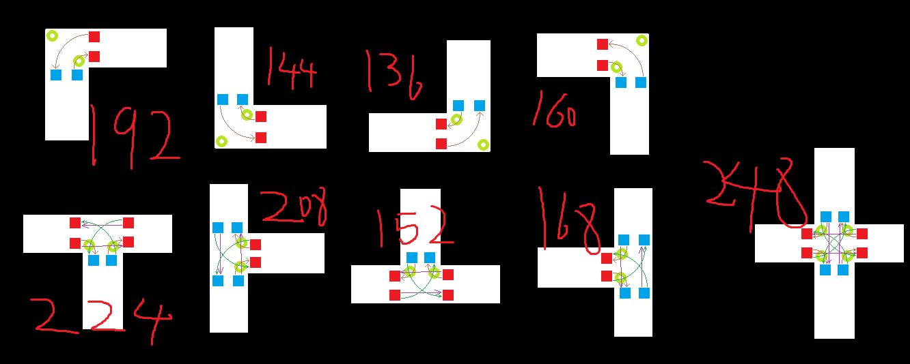

## setDigMap
该任务是对一张平面地图进行处理，完成拓扑结构的建立以及边缘检测

### 使用方法：

```shell
python run.py --down_sampling 8 -L 8 -k 20 --input_image './pics/map1.jpg' -M 10 --output_path './map_xml/formatted_output.xml'
```

### 拓扑结构的建立

1. 使用模板匹配的方式标注所有的**为路口的像素和其类型**，类型如下:

   

2. 标注所有检测出路口的中心位置，Point的类型定义如下：

   ```python
   class Point:
       def __init__(self, pid, y, x, cls):
           self.pid = pid
           self.y = y
           self.x = x
           self.cls = cls
   
       def __str__(self):
           return f"Point: pid={self.pid}, y={self.y}, x={self.x}, cls={self.cls}"
   ```

3. ……

